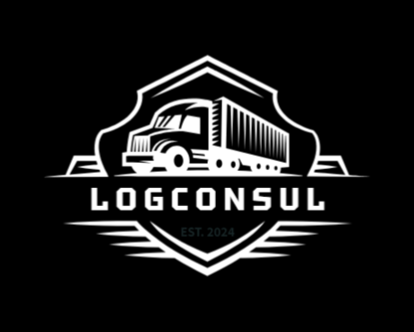
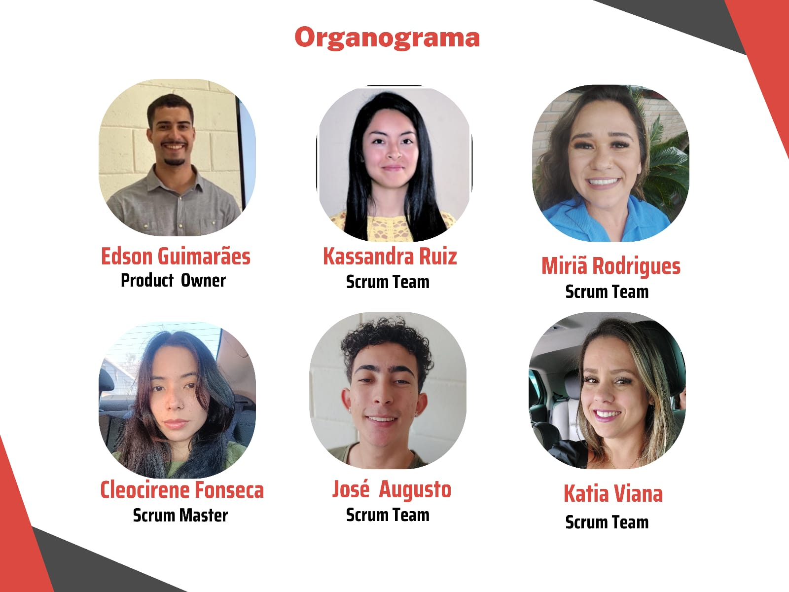

# Análise de produtividade de veículos, de otimização de distribuição e de custo de rotas
 

Projeto baseado na metodologia ágil Scrum e tem como propósito conduzir a análise da produtividade das rotas de uma empresa embarcadora, buscando otimizar sua distribuição e, consequentemente, reduzir os custos logísticos.

# Índice
* [Empresa](#Empresa)
* [Autores](#autores)
* [Objetivos específicos do projeto](#objetivo-específicos-do-projeto)
* [Objetivo do projeto](#objetivos-do-projeto)
* [Datas](#datas)
* [Tecnologias utilizadas](#tecnologias-utilizadas)
* [Linguagens de programação utilizadas](#linguagens-de-programação-utilizadas)
* [Backlog do produto](#backlog-do-produto)
* [MVP 1°Sprint (Minimum Viable Product)](#mvp-1sprint-minimum-viable-product)
* [MVP 2°Sprint (Minimum Viable Product)](#mvp-2sprint-minimum-viable-product)
* [MVP 3°Sprint (Minimum Viable Product)](#mvp-3sprint-minimum-viable-product)
* [MVP 4°Sprint (Minimum Viable Product)](#mvp-4sprint-minimum-viable-product)
* [Competências desenvolvidas](#competências-desenvolvidas)

# Empresa
> Logo

> Missão

Garantir a excelência na entrega de produtos e serviços financeiros, atuando com eficiência e transparência para que os nossos clientes se destaquem.

> Visão

Ser uma empresa visionária, buscando constantemente inovação e tecnologia.

> Valores

Comprometimento
Criatividade
Sustentabilidade
Ética
Inovação

> Swot

      

  

> Organigrama

# Autores

|    Função       |       Nome           |                                                                                                                                                          Contato                                                                                                                                                          |
|:---------------:|:-------------------:|:------------------------------------------------------------------------------------------------------------------------------------------------------------------------------------------------------------------------------------------------------------------------------------------------------------------------:|
| Product Owner   |   Edson Guimarães    |       |
| Scrum Master    |   Cleo Fonseca      |        |
| Team Member     |    José Augusto     |     |
| Team Member     |    Patrícia Viana      |     |
| Team Member     |   Miriã Rodrigues    |    |
| Team Member     |    Yesenia Ruiz   |    

##

# Objetivo específicos do projeto

Em suma, este projeto visa oferecer percepções valiosas e soluções para melhorar a eficiência operacional e a rentabilidade da empresa parceira.

- Análise de Produtividade das rotas.
- Criação e modelagem de um banco de dados em SQL.
- Criação de um visualizador de indicadores em BI.
- Aplicação do método de transportes para otimização da distribuição.

# Objetivos do projeto

Este projeto, hospedado na plataforma GitHub, tem como objetivo facilitar o ambiente colaborativo, proporcionando suporte e facilidade na utilização desta plataforma, visando:

- Centralizar os trabalhos e projetos.
- Organizar e estruturar as informações.
- Versionar e controlar as alterações.
- Facilitar o compartilhamento e feedback.
- Desenvolver habilidades técnicas.

# Datas

Projeto pedagógico fundamentado na Metodologia API para ensino-aprendizado, com foco no desenvolvimento de competências e baseado nos pilares de aprendizado com problemas reais (RPBL), validação externa e mentalidade ágil. Utilizamos estratégias para compreender o problema, conceber uma solução viável durante o desenvolvimento e implementar o MVP, seguido pela sua operação (CDIO).

| Sprint             |    Data      |   Status      | Relatório                                                                                                 | Python                                                                                                       | Power BI                                                                                                     |
|:------------------:|:------------:|:-------------:|:---------------------------------------------------------------------------------------------------------:|:------------------------------------------------------------------------------------------------------------:|:------------------------------------------------------------------------------------------------------------:|
| Kick Off           | 03/09/2024   | Concluído     |                                                                                                           |                                               |                                                                                                              |
| 0                  | 24/09/2024   | Em andamento    |                 |                                               |                                                                                                              |
| 1                  | 15/10/2024   |  Por fazer   |                |                                              |                                     |
| 2                  | 05/11/2024   |  Por fazer |  |   |  |
| 3                  | 26/11/2024   | Por fazer      |                 |                                               |                                    |
| Feira de Soluções  | 12/12/2024   | Por fazer     |

# Tecnologias utilizadas

                                                                     
## Linguagens de programação utilizadas

# Backlog do produto

## Sprint 1. Concepção
- [x] Estruturação do github 
- [x] Documentação github 
- [x] Estruturação do jira
- [x] Logotipo 
- [x] Missão, visão e valores
- [x] Análise SWOT 
- [x] Levantamento de dados 
- [x] Tratamento de dados 
- [x] Aprendizado 
- [x] Power bi 
- [x] Python
- [x] Github Defina o propósito do template
- [ ] Criação do vídeo
- [ ] Finalize e aprovação.

## Sprint 2. Desenvolvimento do Projeto
- [ ] Estudar métodos de transporte 
- [ ] Estruturar a relação de dados n Powe bi 
- [ ] Produtividade mensal dos veículos 
- [ ] Mapeamento de rotas
- [ ] Monitoramento e ajustes.
      
## Sprint 3 . Implementação
- [x] Defina o propósito do template;
- [x] Identifique os elementos principais;
- [x] Esboce o layout;
- [x] Escolha cores e fontes;
- [x] Desenvolva o design;
- [ ] Teste e revise;
- [ ] Documente instruções de uso;
- [ ] Criação do vídeo;
- [ ] Finalize e aprovação.
      
## Sprint 4. Operacionalização
- [x] Defina o propósito do template;
- [x] Identifique os elementos principais;
- [x] Esboce o layout;
- [x] Escolha cores e fontes;
- [x] Desenvolva o design;
- [ ] Teste e revise;
- [ ] Documente instruções de uso;
- [ ] Criação do vídeo;
- [ ] Finalize e aprovação.

  
# Competências desenvolvidas

## Hard Skill (saber tecnológico)

Hard Skills desenvolvidas

  
| Tecnologia/Metodologia | Classificação |
| ---------------------- | ------------- |
| GitHub | ★ ★ ★ ★ ★ ★ ★ ☆ ☆ ☆ |
| Gestão de Projetos | ★ ★ ★ ★ ★ ★ ☆ ☆ ☆ ☆ |
| Scrum Master | ★ ★ ★ ★ ★ ★ ★ ☆ ☆ ☆ |
| Prodct Owner | ★ ★ ★ ★ ★ ★ ★ ☆ ☆ ☆ |
| Markdown | ★ ★ ★ ★ ★ ★ ★ ☆ ☆ ☆ |
| Git Projects | ★ ★ ★ ★ ★ ★ ★ ☆ ☆ ☆ |
 

## Soft Skill (saber comportamental)

Soft Skills desenvolvidas

| Habilidades          | Classificação            |
|----------------------|--------------------------|
| Adaptabilidade       | ☆ ☆ ☆ ☆ ☆ ☆ ☆ ☆ ☆ ☆ |
| Colaboração          | ☆ ☆ ☆ ☆ ☆ ☆ ☆ ☆ ☆ ☆ |
| Comunicação          | ☆ ☆ ☆ ☆ ☆ ☆ ☆ ☆ ☆ ☆ |
| Autonomia            | ☆ ☆ ☆ ☆ ☆ ☆ ☆ ☆ ☆ ☆ |
| Proatividade         | ☆ ☆ ☆ ☆ ☆ ☆ ☆ ☆ ☆ ☆ |
| Entrega de Resultados| ☆ ☆ ☆ ☆ ☆ ☆ ☆ ☆ ☆ ☆ |
